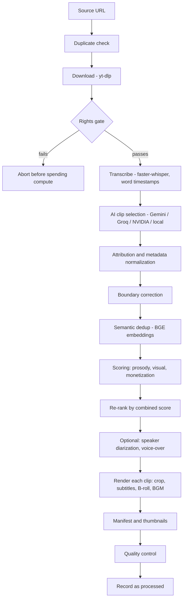

# OpenSource Clipping Autopilot

Turns long videos into short-form clips, and can run unattended. It finds Creative Commons videos from channels you have reviewed, verifies each license, picks the best moments with an LLM plus audio and visual signals, renders vertical clips with face-tracked framing and burned-in captions, and uploads them to YouTube (or Facebook Reels) on a schedule.

It is built on top of [NaufalRizqullah/opensource-clipping](https://github.com/NaufalRizqullah/opensource-clipping) (MIT). See [Credits and license](#17-credits-and-license).

## Contents

1. [What you can do](#1-what-you-can-do)
2. [Quick start](#2-quick-start)
3. [Installation](#3-installation)
4. [Accounts, keys and credentials](#4-accounts-keys-and-credentials)
5. [Everyday usage](#5-everyday-usage)
6. [Automation: discovery, autopilot and scheduling](#6-automation-discovery-autopilot-and-scheduling)
7. [How the pipeline works](#7-how-the-pipeline-works)
8. [Feature reference](#8-feature-reference)
9. [Command-line reference](#9-command-line-reference)
10. [Source-rights model](#10-source-rights-model)
11. [Project layout and code map](#11-project-layout-and-code-map)
12. [Files the pipeline reads and writes](#12-files-the-pipeline-reads-and-writes)
13. [Troubleshooting](#13-troubleshooting)
14. [Testing](#14-testing)
15. [Known issues](#15-known-issues)
16. [Security](#16-security)
17. [Credits and license](#17-credits-and-license)

---

## 1. What you can do

| I want to... | Run | Details |
|---|---|---|
| Cut one video into several shorts | `python main.py --url URL` | [5.1](#51-clip-a-video) |
| Build one chronological ~5 minute summary of a long video | `python main.py --url URL --summary` | [5.1](#51-clip-a-video) |
| Process a list of videos | `python main.py --batch-file videos.csv` | [5.1](#51-clip-a-video) |
| Clip a video and upload the results | `python autopilot.py --url URL --upload-youtube` | [5.3](#53-clip-and-upload-in-one-command) |
| Upload clips that are already rendered | `python run_upload.py` or `python run_fb_upload.py` | [5.2](#52-upload-existing-clips) |
| Log a YouTube channel in for uploading | `python youtube_uploader/generate_youtube_token.py --channel NAME` | [4.3](#43-youtube-upload-login-oauth) |
| Find Creative Commons channels for a niche | `python cc_supply_probe.py --keywords "..."` | [6.2](#62-stage-1-find-channels) |
| Approve or block discovered channels | `python -m clipping.channel_trust pending` | [6.3](#63-stage-2-review-channels) |
| Automatically clip new uploads from approved channels | `python discover_new_clips.py` | [6.4](#64-stage-3-discover-and-clip-new-uploads) |
| Run any of the above on a schedule | launchd, cron or Task Scheduler | [6.6](#66-scheduling-unattended-runs) |

---

## 2. Quick start

Clip one video on a laptop with no NVIDIA GPU:

```bash
git clone https://github.com/rishaan1402/opensource-clipping-autopilot.git
cd opensource-clipping-autopilot

python3 -m venv .venv
source .venv/bin/activate            # Windows: .venv\Scripts\activate
pip install -r requirements.txt

cp .env.sample .env                  # Windows: copy .env.sample .env
# open .env and set GOOGLE_API_KEY (get one free at https://aistudio.google.com/apikey)

python main.py --url "https://www.youtube.com/watch?v=VIDEO_ID" --clips 3 \
  --whisper-device cpu --whisper-compute-type int8 --face-detector yolo
```

Results land in `outputs/`: `highlight_rank_1_ready.mp4`, `thumbnail_rank_1.jpg`, and so on, plus `render_manifest.json` with titles, descriptions and tags.

With an NVIDIA GPU and a CUDA build of PyTorch, drop the last line's flags and just run `python main.py --url URL --clips 3`.

> [!IMPORTANT]
> Your FFmpeg must be built with **libass**, or the caption-burning step fails. Homebrew's plain `ffmpeg` formula is built without it. Check yours with `ffmpeg -filters | grep subtitles` and see [Installation](#3-installation) if nothing prints.

> [!NOTE]
> Examples use bash line continuations (`\`). In PowerShell put the command on one line; in cmd use `^` instead of `\`.

---

## 3. Installation

### 3.1 Requirements

| Requirement | Notes |
|---|---|
| Python 3.10 or newer | 3.12 is what development uses (`.python-version`). |
| Git | To clone the repository. |
| FFmpeg **with libass** | Needed for `subtitles`/`drawtext`. This is the most common install problem. |
| A few GB of free disk | First run downloads models (Whisper, YOLO face weights, the Hugging Face BGE and SigLIP models) and each source video is downloaded locally. |
| Deno (recommended) | yt-dlp uses it to solve YouTube's download challenge. Without it yt-dlp warns and some formats can be missing; on cloud IPs downloads can fail outright. |
| NVIDIA GPU + CUDA (optional) | Much faster Whisper transcription and YOLO tracking. CPU works, just slower. |

The macOS/CPU path has been exercised end to end. CUDA, Linux and Windows use the same code with standard tooling; if something differs on your machine, see [Troubleshooting](#13-troubleshooting).

### 3.2 macOS

```bash
brew install python@3.12 git deno
brew install ffmpeg-full             # keg-only build that includes libass
echo 'export PATH="$(brew --prefix ffmpeg-full)/bin:$PATH"' >> ~/.zshrc
source ~/.zshrc
```

Homebrew's plain `ffmpeg` formula has no libass, so use `ffmpeg-full` (or the `homebrew-ffmpeg/ffmpeg` tap) and make sure it comes first on `PATH`. On a Mac there is no CUDA, so always run with:

```
--whisper-device cpu --whisper-compute-type int8 --face-detector yolo
```

MediaPipe's GPU delegate hard-crashes the whole process on macOS, which is why `--face-detector yolo` is required there.

### 3.3 Linux (Debian/Ubuntu)

```bash
sudo apt update
sudo apt install -y python3-venv python3-pip git ffmpeg
curl -fsSL https://deno.land/install.sh | sh
```

Distribution FFmpeg builds normally include libass; confirm with the check in [3.6](#36-verify-the-install). For GPU use, install the NVIDIA driver first, then a CUDA build of PyTorch ([3.5](#35-python-packages)).

### 3.4 Windows

1. Install **Python 3.12** from [python.org](https://www.python.org/downloads/) (tick "Add python.exe to PATH") and **Git for Windows**.
2. Install a **full GPL FFmpeg build** (for example the "full" build from [gyan.dev](https://www.gyan.dev/ffmpeg/builds/) or BtbN's GPL build), unzip it, and add its `bin` folder to your `PATH`. Essentials-style builds may omit libass.
3. For GPU use, install the standard GeForce **Game Ready driver** (no special driver is needed for CUDA) and confirm with `nvidia-smi`.
4. Install Deno: `irm https://deno.land/install.ps1 | iex`
5. In PowerShell, if activating the virtualenv is blocked: `Set-ExecutionPolicy -Scope Process RemoteSigned`

Then follow [3.5](#35-python-packages), using `.venv\Scripts\activate` to activate the environment.

### 3.5 Python packages

```bash
python3 -m venv .venv
source .venv/bin/activate            # Windows: .venv\Scripts\activate
python -m pip install --upgrade pip
pip install -r requirements.txt
```

`requirements.txt` is the complete list. `pyproject.toml` only lists a subset (it is missing `edge-tts`, `pyannote.audio`, `torch`, `torchaudio` and others), so installing from it alone gives an incomplete environment.

Optional extras that `requirements.txt` does not declare:

| Package | Needed for |
|---|---|
| `openai` | `--ai-provider nvidia`, `groq` or `local` (all three use the OpenAI-compatible client) |
| `gdown` | `--source gdrive` (Google Drive links) |

```bash
pip install openai gdown
```

**GPU builds.** `requirements.txt` installs whatever PyTorch pip picks by default, which is usually CPU-only. For CUDA, install the matching build from [pytorch.org](https://pytorch.org/get-started/locally/), for example:

```bash
pip uninstall -y torch torchaudio
pip install torch torchaudio --index-url https://download.pytorch.org/whl/cu121
```

Faster-Whisper runs on CTranslate2, which needs the CUDA 12 runtime libraries (cuBLAS and cuDNN) to be findable. If it reports missing `cublas`/`cudnn` libraries, install them or fall back to `--whisper-device cpu`. On cards with about 4 GB of VRAM, try `--whisper-compute-type int8_float16` (or `int8`) before dropping to a smaller `--whisper-model`, and watch memory with `nvidia-smi`.

### 3.6 Verify the install

```bash
python main.py --help                                   # CLI loads
ffmpeg -filters | grep -E "subtitles|drawtext"          # Windows: ffmpeg -filters | findstr subtitles
python -c "import torch; print('cuda available:', torch.cuda.is_available())"
python -m unittest discover -s clipping/phase1/tests -t .
```

The `ffmpeg -filters` line must print `subtitles`. The CUDA line is only relevant if you installed a GPU build.

---

## 4. Accounts, keys and credentials

### 4.1 Environment variables (`.env`)

Copy `.env.sample` to `.env` and fill in what you need. Every value is read from the environment, so real shell variables work too.

| Variable | Needed for | Where to get it |
|---|---|---|
| `GOOGLE_API_KEY` | Gemini clip selection, commentary and summary (the default AI provider) | [aistudio.google.com/apikey](https://aistudio.google.com/apikey) |
| `YOUTUBE_DATA_API_KEY` | Channel discovery, `--source-rights licensed_cc`, `cc_supply_probe.py`, `discover_new_clips.py` | [Google Cloud credentials](https://console.cloud.google.com/apis/credentials); enable "YouTube Data API v3" first. API key only, read-only calls. |
| `GROQ_API_KEY` | `--ai-provider groq` | [console.groq.com](https://console.groq.com) |
| `NVIDIA_API_KEY` | `--ai-provider nvidia` | [build.nvidia.com](https://build.nvidia.com) |
| `HF_TOKEN` | Speaker diarization for `--split-screen` (audio trigger) and `--camera-switch` | [huggingface.co/settings/tokens](https://huggingface.co/settings/tokens); also accept the [pyannote/speaker-diarization-3.1](https://huggingface.co/pyannote/speaker-diarization-3.1) terms |
| `PEXELS_API_KEY` | B-roll stock footage | [pexels.com/api](https://www.pexels.com/api/) |
| `META_PAGE_ID`, `META_PAGE_ACCESS_TOKEN`, `META_GRAPH_VERSION` | Facebook Reels uploader | A Facebook Page access token with `pages_manage_posts` and `pages_read_engagement` |
| `APP_TIMEZONE` | Default timezone (IANA name) for the Facebook uploader's schedule | e.g. `Asia/Jakarta` |

`.env.sample` does not currently list `GROQ_API_KEY`; add it yourself if you use Groq.

### 4.2 Choosing an AI provider

| Provider | Flag | Key / setup | Notes |
|---|---|---|---|
| Gemini (default) | `--ai-provider gemini` | `GOOGLE_API_KEY` | Falls back to `--gemini-fallback-model` if the main model keeps failing. Retries up to 10 times with growing waits on 429/5xx. |
| Groq | `--ai-provider groq` | `GROQ_API_KEY`, `pip install openai` | Videos longer than `--groq-max-duration-seconds` (default 600) are skipped unless `--groq-oversized-fallback-gemini` is set, because a long transcript blows the free-tier token budget. |
| NVIDIA NIM | `--ai-provider nvidia` | `NVIDIA_API_KEY`, `pip install openai` | Model set with `--nvidia-model`. 3 attempts. |
| Local vLLM | `--ai-provider local` | A running vLLM OpenAI-compatible server, `pip install openai` | `--local-base-url` (default `http://localhost:8000/v1`) and `--local-model` must match the server. The Kaggle notebook shows how to start one on two T4 GPUs. |

### 4.3 YouTube upload login (OAuth)

Uploading needs a login per destination channel. Do this once per channel.

1. **Create the YouTube channel** (a Brand Account is fine).
2. **Create a Google Cloud project** at [console.cloud.google.com](https://console.cloud.google.com) and enable **YouTube Data API v3**. Quota is counted per project, so a separate project per channel gives each channel its own quota (see [4.4](#44-youtube-api-quotas)).
3. **Configure the OAuth consent screen**: user type **External**, fill in the required fields, and add the Google account that owns the channel as a **test user**.
4. **Create credentials**: *Credentials, Create credentials, OAuth client ID*, application type **Desktop app**. Download the JSON and save it as `.credentials/<channel>/client_secret.json` (for example `.credentials/knowledge/client_secret.json`).
5. **Generate the token.** Run this in your own terminal (not through a remote or headless session), because it opens a browser for you to log in and grant access:

   ```bash
   python youtube_uploader/generate_youtube_token.py --channel knowledge
   ```

   This writes `.credentials/knowledge/youtube_token.json` (scopes: `youtube.upload` and `youtube.readonly`).
6. **Use it** by passing `--youtube-token-file .credentials/knowledge/youtube_token.json` to `autopilot.py`, `discover_new_clips.py` or `run_upload.py`.

Uploads are created **private with a scheduled publish time**, so nothing goes public until its slot arrives and you can review or delete it in YouTube Studio first.

> [!WARNING]
> **Testing-mode tokens expire after 7 days.** Google issues refresh tokens that last only 7 days to External apps whose consent screen is left in the **Testing** publishing status. For unattended use, open the OAuth consent screen and **publish the app to "In production"** (for your own account this just shows an "unverified app" warning), then **re-run the token generator once** to get a long-lived token. Tokens issued while in Testing keep their 7-day limit. Symptom of an expired token: uploads fail with `invalid_grant` / "Token has been expired or revoked".

### 4.4 YouTube API quotas

Per Google's [quota documentation](https://developers.google.com/youtube/v3/determine_quota_cost) (checked September 2026; Google changes these, so re-check), each Cloud project gets:

| Bucket | Daily allowance |
|---|---|
| `videos.insert` (uploads) | 100 calls |
| `search.list` | 100 calls |
| Everything else (reads such as `videos.list`, `playlistItems.list`, `channels.list`) | 10,000 units, 1 unit per call for those |

Quotas reset at midnight Pacific Time. Practical consequences:

- One project can upload up to about 100 videos a day. A separate project per channel multiplies that.
- `cc_supply_probe.py` spends 2 `search.list` calls per keyword (one per duration bucket), so the 100/day search allowance covers roughly 50 keywords a day.
- `discover_new_clips.py` uses only cheap read calls, and `--channel-poll-limit` bounds how many channels it touches per run.
- A `403 quotaExceeded` means you hit a bucket; it clears at the next reset.

### 4.5 YouTube cookies (only if you hit the bot check)

On cloud or datacenter IPs YouTube often answers with "Sign in to confirm you're not a bot". Export a Netscape-format `cookies.txt` from a browser where you are logged in to YouTube, save it as `.credentials/cookies.txt`, and pass `--cookies-file .credentials/cookies.txt`. Home connections usually don't need this. Treat the file like a password: it carries a logged-in session.

---

## 5. Everyday usage

### 5.1 Clip a video

```bash
# 5 vertical (9:16) clips
python main.py --url "https://www.youtube.com/watch?v=VIDEO_ID" --clips 5

# Steer what the AI picks (free text added to the selection prompt)
python main.py --url URL --clips 5 \
  --clip-focus "Prefer practical advice; skip intros and sponsor reads"

# One chronological ~5 minute summary edit (16:9) instead of independent shorts
python main.py --url URL --summary --summary-minutes 5

# Other aspect ratios: 16:9, 1:1, 4:5, 3:4
python main.py --url URL --ratio 1:1

# Podcasts: split screen (face trigger needs no HF token) or camera switching (needs HF_TOKEN)
python main.py --url URL --ratio 9:16 --split-screen --dynamic-split --split-trigger face
python main.py --url URL --ratio 9:16 --camera-switch

# AI voice-over commentary on top of the clip
python main.py --url URL --voiceover --voiceover-lang en --voiceover-style analysis

# Other sources
python main.py --url "https://www.tiktok.com/@user/video/123" --source tiktok
python main.py --url "https://drive.google.com/file/d/ID/view" --source gdrive

# Many videos in one go (CSV with url,title,tags columns; JSON and one-URL-per-line TXT also work)
python main.py --batch-file videos.csv
```

Useful habits:

- **Re-use the AI result** while tuning the render: add `--load-gemini-json` to skip the selection call.
- **Re-run the same URL after changing render options:** the pipeline resumes from a checkpoint and can reuse an earlier render. Add `--reset-checkpoint` to force a fresh run. `--force-reprocess` silences the "already processed" warning.
- **Hook teaser:** `main.py` keeps the 3-second hook teaser by default (`--no-hook` removes it). `autopilot.py` and `discover_new_clips.py` produce uniform clips without it by default.
- **Clip length:** the AI is asked for clips between 20 and 179 seconds.

Batch mode gives every item its own folder under `outputs/batch/` and writes `outputs/batch_report.json`.

### 5.2 Upload existing clips

```bash
# YouTube: reads outputs/render_manifest.json, schedules each clip, applies upload_safety.json
python run_upload.py --token-file .credentials/knowledge/youtube_token.json

# Only the first clip, as a test
python run_upload.py --token-file .credentials/knowledge/youtube_token.json --test-mode

# Facebook Reels (needs META_* variables)
python run_fb_upload.py --interval-hours 5
```

How scheduling works: each clip gets a publish time spaced by `--interval-hours`, starting after the latest video already scheduled on the channel (or a fallback time if none). Clips already uploaded are skipped on re-runs.

**Safety limits** live in `upload_safety.json`:

| Key | Meaning |
|---|---|
| `max_upload_per_day` | Stop once this many uploads happened today (counted from the log file). |
| `max_upload_per_run` | Upload at most this many clips per invocation. |
| `interval_hours_min` | Floor for the gap between scheduled clips; a smaller `--interval-hours` is raised to this. |
| `max_scheduled_queue` | Refuse to add more if the channel already has this many future-scheduled videos. |
| `require_manual_approval` | Ask "Upload this video? (y/n)" for each clip. **Uses `input()`, so it cannot work in a scheduled job.** Set to `false` (or pass `--no-approval`) for unattended runs. |
| `upload_log_file` | Where uploads are recorded (default `outputs/upload_history.json`). |

### 5.3 Clip and upload in one command

```bash
python autopilot.py --url URL --clips 5 \
  --upload-youtube --youtube-token-file .credentials/knowledge/youtube_token.json

# Clip once, upload to both platforms
python autopilot.py --url URL --clips 5 --upload-youtube --upload-facebook

# Re-run only the upload stage against an existing manifest
python autopilot.py --skip-clip --upload-youtube --manifest-file outputs/render_manifest.json
```

`autopilot.py` accepts every `main.py` flag (it forwards what it doesn't recognise), so `--whisper-device cpu --face-detector yolo --source-rights licensed_cc` and the rest all work. It defaults to no hook teaser; pass `--with-hook` to keep it.

---

## 6. Automation: discovery, autopilot and scheduling

The automated flow is four stages. Only stage 2 needs a human, and only once per channel.

```
cc_supply_probe.py  ->  clipping.channel_trust  ->  discover_new_clips.py  ->  autopilot.py
(find CC channels)      (review: approve/block)     (poll approved channels,    (clip + upload)
                                                     pick new uploads)
```

### 6.1 Why the review step exists

A "Creative Commons" tag on one video proves little: news re-uploaders and "free footage" channels sometimes tag content they did not create. So a channel must (a) release CC content consistently and (b) be approved before any of its videos can pass the rights gate. See [10. Source-rights model](#10-source-rights-model) for the exact rules.

### 6.2 Stage 1: find channels

```bash
python cc_supply_probe.py --keywords "history explained" "psychology facts" "study with me" \
  --min-views 10000 --min-view-velocity 300 --published-after-days 365
```

For each keyword it searches Creative Commons videos, re-checks each video's license, samples every channel's recent uploads to measure how consistently it uses CC, and stores a verdict in `data/channel_trust.db`. Full results go to `data/cc_supply_probe_<timestamp>.json`.

| Flag | Default | Meaning |
|---|---|---|
| `--keywords` | required | One or more search phrases. |
| `--min-duration` | `180` | Skip videos shorter than this many seconds. |
| `--max-results` | `50` | Results per keyword per duration bucket (max 50). |
| `--min-views` | `0` | Drop videos below this lifetime view count. |
| `--min-view-velocity` | `0` | Drop videos below this views-per-day rate; a stronger "is it breaking out now" signal than raw views. |
| `--published-after-days` | none | Only search videos published within this many days. |
| `--out` | timestamped file in `data/` | Where to save the JSON results. |

### 6.3 Stage 2: review channels

```bash
python -m clipping.channel_trust pending                  # channels awaiting a decision
python -m clipping.channel_trust approve <channel_id>     # its CC content may now be clipped
python -m clipping.channel_trust block <channel_id>       # never use this channel
python -m clipping.channel_trust auto-approved            # audit: channels that skipped review

# Periodic re-audits (both demote to pending, which is reversible):
python -m clipping.channel_trust revalidate-views
python -m clipping.channel_trust revalidate-velocity
```

Channels that clear a high bar are approved automatically, so you only look at the ambiguous middle. The thresholds are in [10.3](#103-channel-trust-and-review).

### 6.4 Stage 3: discover and clip new uploads

```bash
python discover_new_clips.py --dry-run                     # list what it would process
python discover_new_clips.py --max-new 3 --clips 3         # clip only
python discover_new_clips.py --max-new 3 --upload-youtube \
  --youtube-token-file .credentials/knowledge/youtube_token.json   # clip and publish
python discover_new_clips.py --from-probe-files            # draw from saved probe results (older back catalogue)
```

What it does on each run:

1. Takes a rotating batch of approved channels (`--channel-poll-limit`, default 50, oldest-polled first, so all channels get covered across runs).
2. Reads each channel's recent uploads, drops anything already processed, and re-checks the license live.
3. Keeps videos between `--min-duration` and `--max-duration`, and interleaves channels so one prolific channel cannot fill the whole batch.
4. Runs `autopilot.py --source-rights licensed_cc` on up to `--max-new` videos, one subprocess each, so a failure never stops the rest.

A lock file (`data/discover_new_clips.lock`) stops two runs overlapping, which matters once it is scheduled. It defaults to CPU-friendly settings (`--whisper-model small --whisper-device cpu --whisper-compute-type int8 --face-detector yolo --source-height 1080`); on a GPU add `--whisper-device cuda --whisper-compute-type float16`.

### 6.5 Stage 4: autopilot

`autopilot.py` is what stage 3 calls for every video; see [5.3](#53-clip-and-upload-in-one-command).

### 6.6 Scheduling unattended runs

Scheduled jobs run with no terminal and a minimal `PATH`. Use absolute paths to the virtualenv's Python, put FFmpeg's folder on `PATH`, set `require_manual_approval` to `false`, and write output to a log file.

**macOS (launchd).** Save as `~/Library/LaunchAgents/com.opensourceclipping.discover.plist`, adjusting the paths:

```xml
<?xml version="1.0" encoding="UTF-8"?>
<!DOCTYPE plist PUBLIC "-//Apple//DTD PLIST 1.0//EN" "http://www.apple.com/DTDs/PropertyList-1.0.dtd">
<plist version="1.0">
<dict>
  <key>Label</key><string>com.opensourceclipping.discover</string>
  <key>ProgramArguments</key>
  <array>
    <string>/path/to/repo/.venv/bin/python3</string>
    <string>discover_new_clips.py</string>
    <string>--max-new</string><string>3</string>
  </array>
  <key>WorkingDirectory</key><string>/path/to/repo</string>
  <key>EnvironmentVariables</key>
  <dict>
    <key>PATH</key>
    <string>/opt/homebrew/opt/ffmpeg-full/bin:/opt/homebrew/bin:/usr/bin:/bin</string>
  </dict>
  <key>StartCalendarInterval</key>
  <dict><key>Hour</key><integer>9</integer><key>Minute</key><integer>0</integer></dict>
  <key>StandardOutPath</key><string>/path/to/repo/logs/discover_stdout.log</string>
  <key>StandardErrorPath</key><string>/path/to/repo/logs/discover_stderr.log</string>
</dict>
</plist>
```

```bash
mkdir -p logs
launchctl load ~/Library/LaunchAgents/com.opensourceclipping.discover.plist
launchctl start com.opensourceclipping.discover      # run once now
launchctl unload ~/Library/LaunchAgents/com.opensourceclipping.discover.plist
```

To run more often than daily, replace `StartCalendarInterval` with `<key>StartInterval</key><integer>7200</integer>` (every 2 hours).

**Linux (cron).** `crontab -e`:

```cron
PATH=/usr/local/bin:/usr/bin:/bin
0 */2 * * * cd /path/to/repo && .venv/bin/python discover_new_clips.py --max-new 3 >> logs/discover.log 2>&1
```

**Windows (Task Scheduler).** From an elevated prompt (adjust paths; every 2 hours):

```bat
schtasks /Create /SC HOURLY /MO 2 /TN "ClippingDiscover" ^
  /TR "cmd /c cd /d C:\path\to\repo && .venv\Scripts\python.exe discover_new_clips.py --max-new 3 >> logs\discover.log 2>&1"
```

Make sure FFmpeg's folder is on the system `PATH` (not just your user session) so the task can see it.

### 6.7 Running on Kaggle

`notebooks/Kaggle_Autopilot.ipynb` runs `discover_new_clips.py` on a Kaggle GPU notebook (2x T4). It expects you to: enable the GPU accelerator, add `GOOGLE_API_KEY` (and optionally `YOUTUBE_DATA_API_KEY`, `HF_TOKEN`) as Kaggle Secrets, attach datasets holding the code and your prior state (`data/`, `outputs/`, `.credentials/`), and it installs requirements and Deno for you. It can optionally start a local vLLM server so `--ai-provider local` needs no external API, and it copies state back to `/kaggle/working` at the end so it survives between sessions. Pass `--cookies-file` here, because Kaggle's IPs trigger YouTube's bot check.

---

## 7. How the pipeline works



| Stage | What happens | Code |
|---|---|---|
| Duplicate check | Warns if this exact URL was processed before (does not block). | `clipping/phase1/deduplication.py` |
| Download | yt-dlp fetches the video and records uploader, channel and license. Any stale file at the target path is removed first. | `engine.download_video` |
| Rights gate | Re-verifies the declared `--source-rights` claim. | `clipping/rights.py` |
| Transcribe | Faster-Whisper with word-level timestamps (or YouTube's own subtitles with `--use-dlp-subs`). | `engine.transcribe_video` |
| AI selection | One LLM call returns the top moments: timing, viral score, hook, titles, tags, typography and B-roll plans, destination-account classification. | `engine.analyze_with_*` |
| Attribution | Adds the "Source: uploader - URL" line to descriptions when one is owed. | `rights.build_attribution_source_url` |
| Boundary correction | Extends an end time that lands mid-sentence to the next sentence end (bounded). | `phase1/boundary_correction.py` |
| Semantic dedup | Drops candidates that restate the same moment (cosine similarity above 0.92). | `phase1/semantic_dedup.py` |
| Scoring | Prosody (pitch/energy/pauses), visual interest (SigLIP), and monetization heuristics. | `phase1/prosody_scoring.py`, `visual_scoring.py`, `monetization.py` |
| Re-rank | Sorts by the combined score and renumbers ranks. | `phase1/candidate_scoring.py` |
| Diarization / voice-over | Speaker labels for podcast modes; LLM commentary plus text-to-speech. | `diarization.py`, `voiceover.py` |
| Render | Face-tracked crop, karaoke captions, optional B-roll and BGM, then FFmpeg encode. | `clipping/studio/` |
| Manifest | Writes `render_manifest.json`, `metadata_preview.json`, `clip_candidates.json`. | `runner.py`, `metadata.py` |
| Quality control | Checks duration, audio level and file integrity of every clip. | `phase1/quality_control.py` |
| Record | Stores the source in the dedup database. | `phase1/deduplication.py` |

**Ranking.** Each candidate gets

```
combined_score = quality_weight    * (AI viral_score / 100)
               + monetization_weight * monetization_score
               + prosody_weight      * prosody_score
               + visual_weight       * visual_score
```

Defaults are 0.7 / 0.3 / 0 / 0, and the four weights must sum to 1. Prosody and visual scores are computed and saved with each candidate but do not affect ranking until you give them a non-zero weight (lower the other weights so the total stays 1), for example `--quality-weight 0.5 --monetization-weight 0.2 --prosody-weight 0.15 --visual-weight 0.15`.

**Monetization score** combines a hook-strength estimate, a first-seconds "viewed vs swiped away" estimate (which uses a quick face/motion probe of the opening frames), a retention estimate, length fit, and whether the clip ends on a complete thought.

**Robustness.** Download and transcription are checkpointed and each render is checkpointed per clip, so an interrupted run resumes. The LLM call retries on transient errors and can fall back to a second model.

---

## 8. Feature reference

### Clip selection and scoring

| Feature | How to use it | What it does |
|---|---|---|
| AI moment selection | default | Picks the N most engaging moments and explains why. |
| Selection steering | `--clip-focus "..."` | Adds your instruction to the selection prompt. |
| Summary edit | `--summary`, `--summary-minutes` | One chronological edit (context, key points, conclusion) cut on sentence boundaries, 16:9. |
| Boundary correction | on; `--no-boundary-correction`, `--max-boundary-extension` | Stops clips ending mid-sentence. Unfixable clips are tagged `boundary_issue`. |
| Semantic dedup | on; `--no-semantic-dedup`, `--semantic-dedup-threshold`, `--bge-model` | Removes near-duplicate candidates within one video. |
| Prosody scoring | on; `--no-prosody-scoring`, `--prosody-weight` | Audible emphasis from pitch and energy variance and pause ratio (librosa). |
| Visual scoring | on; `--no-visual-scoring`, `--visual-weight`, `--siglip-model` | Zero-shot "engaging vs boring" score from sampled frames (SigLIP). |
| Monetization scoring | on; `--no-monetization-scoring`, `--quality-weight`, `--monetization-weight` | Hook, retention, length and payoff heuristics blended with the AI score. |
| Face/motion probe | automatic | Cheap has-face / has-motion check of a candidate's opening seconds; honours `--face-detector`. |

### Rendering

| Feature | How to use it | What it does |
|---|---|---|
| Aspect ratios | `--ratio 9:16 / 16:9 / 1:1 / 3:4 / 4:5` | Output framing. |
| Face-tracked auto-framing | `--face-detector mediapipe / yolo`, `--yolo-size`, `--track-*` | Follows the speaker with smoothing, dead-zone and anti-jitter controls. `--static-crop` turns it off for 1:1, 3:4 and 4:5. |
| Karaoke captions | on; `--words-per-sub`, `--no-karaoke`, `--no-subs` | Word-by-word highlighted subtitles burned in with libass. |
| Font styles | `--font-style DEFAULT / STORYTELLER / HORMOZI / CINEMATIC` | Caption typography presets (fonts download on first use). |
| Kinetic typography | `--advanced-text`, `--advanced-text-hook` | AI-chosen emphasis words with bounce and stagger animation. |
| Hook teaser | on in `main.py`; `--no-hook`, `--hook-duration`, `--hook-source`, `--hook-source-start` | Short opening teaser with a glitch transition. |
| Hook V2 | `--hook-v2`, `--hook-v2-items`, `--hook-v2-style`, `--white-flash-duration` | 3 to 4 micro-hooks joined by flashes or glitches. |
| Segment trimming | on; `--no-segment-trim`, `--silence-trim` | Cuts boring or silent stretches out of the middle of a clip. |
| B-roll | on; `--no-broll` (needs `PEXELS_API_KEY`) | Inserts contextual Pexels footage with crossfades. |
| Background music | on; `--no-bgm`, `--bgm-mode ducking / background` | Loops a random `.mp3` from `assets/bgm/<mood>/` (`chill`, `epic`, `sad`, `upbeat`, `suspense`), ducking under speech. You supply the audio files. |
| Watermark | `--watermark` with `--text` or `--image`, `--position`, `--opacity`, `--padding`, `--watermark-scale` | Text or image overlay at any of 9 anchors. |
| Thumbnails | automatic | A frame with the clip title on top, saved as `thumbnail_rank_N.jpg`. |
| Encoder and quality | `--video-bitrate`, `--video-crf`, `--video-cq`, `--video-preset`, `--video-scale-algo`, `--video-sharpen`, `--render-height` | Picks NVENC when available, otherwise libx264. |
| Edge glow | `--edge-glow`, `--edge-glow-mode` | Ambient gradient glow around the frame. |
| Debug views | `--dev-mode`, `--box-face-detection`, `--track-lines` | Visualize tracking and stabilization. |

### Podcast modes

| Mode | Flags | Behaviour |
|---|---|---|
| Split screen | `--split-screen`, `--dynamic-split`, `--split-trigger diarization / face`, `--split-zoom`, `--split-v-align`, `--split-auto-zoom`, `--split-max-zoom`, `--diarization-speakers` | Speakers stacked top and bottom (9:16 only). `diarization` needs `HF_TOKEN`; `face` does not. |
| Camera switch | `--camera-switch`, `--switch-hold-duration`, `--switch-blend-duration` | Cuts to whoever is talking; blurred pillarbox when two people in one shot talk at once. Needs `HF_TOKEN`. |

### Voice-over

`--voiceover` writes an original commentary script with the LLM, speaks it with free `edge-tts` voices, ducks the source audio (`--original-volume`), and replaces on-screen captions with the narrator's words. Options: `--voiceover-voice`, `--voiceover-lang en/id`, `--voiceover-style analysis/reaction/lesson/summary`, `--voiceover-length short/normal/long`, `--voiceover-volume`.

### Sources

| Source | Flag | Notes |
|---|---|---|
| YouTube | default | `--use-dlp-subs` reuses YouTube's own subtitles and skips Whisper when found. |
| TikTok | `--source tiktok` | |
| Instagram | `--source instagram` | |
| Google Drive | `--source gdrive` | Needs `pip install gdown`. |
| Lists of videos | `--batch-file` | CSV, JSON or TXT. |

### Safety and bookkeeping

| Feature | How to use it | What it does |
|---|---|---|
| Source-rights gate | `--source-rights ...` | See [10](#10-source-rights-model). |
| Checkpoint and resume | on; `--no-checkpoint`, `--reset-checkpoint` | Skips finished download, transcription and per-clip renders on re-run. |
| Duplicate tracking | on; `--force-reprocess`, `--dedup-db-dir` | Remembers processed URLs in `data/processed.db`. |
| Quality control | on; `--no-quality-control`, `--qc-strict` | Validates each rendered clip. |
| Upload safety | `upload_safety.json` | Daily, per-run and queue limits plus optional manual approval. |

---

## 9. Command-line reference

Every script supports `--help`. Sections are collapsed; click to expand.

### 9.1 `main.py` (single video, batch and summary mode)

All flags below can also be passed through `autopilot.py` and, where listed in 9.3, `discover_new_clips.py`.

<details>
<summary>Show all <code>main.py</code> flags (118)</summary>

#### Core options

| Flag | Default | What it does |
|---|---|---|
| `--url`, `-u` | - | Video URL to process (supports YouTube, TikTok, Instagram, Google Drive). Required unless --batch-file is used. |
| `--batch-file` | - | Path to a CSV/JSON/TXT file listing multiple videos to process in sequence (CSV columns: url,title,tags). Each item gets its own isolated output directory under outputs/batch/. Mutually exclusive with --url. |
| `--source` | `youtube` | Video source platform. Determines download behavior and subtitle availability. Choices: `youtube`, `tiktok`, `instagram`, `gdrive`. |
| `--tiktok` | off | [DEPRECATED] Use --source tiktok instead. |
| `--clips`, `-n` | `7` | Number of highlight clips to generate |
| `--clip-focus` | - | Free-text direction added to the clip-selection prompt, e.g. 'Prefer spoken interview moments; avoid live musical performances' or 'Do not select these time ranges: ...'. Steers which moments are picked; does not change how they are cut. |
| `--summary` | off | Build ONE chronological summary edit of the whole video (context, key points, conclusion) instead of independent clips. Always renders 16:9. Reuses the download and cached transcript; --clip-focus steers what it covers. |
| `--summary-minutes` | `5.5` | Target length of the --summary edit in minutes (default: 5.5). |
| `--ratio`, `-r` | `9:16` | Output aspect ratio Choices: `9:16`, `16:9`, `1:1`, `3:4`, `4:5`. |
| `--source-height` | `max` | Preferred source download max height. Use 'max' to fetch highest available quality. |
| `--cookies-file` | - | Path to a Netscape-format cookies.txt (exported from a real logged-in YouTube session) for yt-dlp to authenticate with. Fixes YouTube's 'Sign in to confirm you're not a bot' block, which cloud/datacenter IPs (Kaggle, Colab, etc.) trip far more often than residential ones. |
| `--render-height` | `1080` | Target output height for the render. Use 'source' to match the source video height, or a number (e.g. 1080, 1440). |
| `--words-per-sub` | `5` | Max words per karaoke subtitle group |
| `--hook-duration` | `3` | Hook teaser duration in seconds |
| `--hook-source` | - | Google Drive URL or local path for a single custom hook video (.mp4) |
| `--hook-source-start` | `0.0` | Start time in seconds for the custom hook video |
| `--no-broll` | off | Disable B-roll footage |
| `--no-hook` | off | Disable hook glitch teaser |
| `--no-bgm` | off | Disable background music |
| `--bgm-mode` | `ducking` | BGM mixing mode: 'ducking' (sidechain compress — BGM auto-lowers during speech) or 'background' (constant low volume mix) Choices: `ducking`, `background`. |
| `--no-karaoke` | off | Disable karaoke highlight effect (use clean text instead) |
| `--split-screen` | off | Enable split-screen mode for podcast with 2 speakers (9:16 only, requires HF_TOKEN for Pyannote) |
| `--diarization-speakers` | `auto` | Number of speakers for diarization, or 'auto' to auto-detect visually (used with --split-screen or --camera-switch) |
| `--camera-switch` | off | Enable camera-switch mode for podcast (9:16 only, requires HF_TOKEN). Mutually exclusive with --split-screen; split-screen takes precedence if both are set. |
| `--switch-hold-duration` | `2.0` | Minimum seconds to hold on the current speaker before switching cameras (camera-switch mode only) |
| `--switch-blend-duration` | `0.0` | Blend duration when switching speakers (0 = instant snap, 0.2 = smooth 200ms transition). Default is 0 (instant snap). |
| `--no-subs` | off | Disable all subtitle rendering (useful if you only want the video without text) |
| `--dynamic-split` | off | Automatically switch between full-screen (1 speaker) and split-screen (2 speakers) based on who is talking. Only active with --split-screen. |
| `--split-trigger` | `diarization` | The trigger used to decide when to split the screen. 'diarization' uses audio (who is talking), 'face' uses video (how many faces are visible). Choices: `diarization`, `face`. |
| `--split-zoom` | `1.0` | Zoom factor for split-screen panels (e.g. 1.2, 1.5). Default is 1.0 (no zoom). |
| `--split-v-align` | `0.5` | Vertical alignment for split-screen panels (0.0=top, 0.5=center, 1.0=bottom). Default is 0.5 (center). |
| `--split-auto-zoom` | off | Automatically zoom in each split-screen panel until only one person is visible in each frame. |
| `--split-max-zoom` | `2.5` | Maximum zoom factor allowed for auto-zoom (default: 2.5). |
| `--font-style` | `HORMOZI` | Font style preset Choices: `DEFAULT`, `STORYTELLER`, `HORMOZI`, `CINEMATIC`. |
| `--advanced-text` | off | Enable advanced kinetic typography |
| `--advanced-text-hook` | off | Enable advanced typography on hook |
| `--use-dlp-subs` | off | Use yt-dlp to download auto/manual subtitles to speed up process (skipping Whisper if found) |
| `--whisper-model` | `large-v3` | Faster-Whisper model size |
| `--whisper-device` | `cuda` | Device for Whisper inference Choices: `cuda`, `cpu`, `auto`. |
| `--whisper-compute-type` | `float16` | Compute type for Whisper (float16, int8, etc.) |
| `--face-detector` | `mediapipe` | AI model for face tracking (mediapipe is CPU, yolo uses GPU if available) Choices: `mediapipe`, `yolo`. |
| `--yolo-size` | `8m` | YOLO face model version/size (8n, 8s, 8m, 8n_v2, 9c). Only active if --face-detector yolo Choices: `8n`, `8s`, `8m`, `8n_v2`, `9c`. |
| `--ai-provider` | `gemini` | AI provider for video analysis (gemini, nvidia, groq, or local). Choices: `gemini`, `nvidia`, `groq`, `local`. |
| `--nvidia-model` | `deepseek-ai/deepseek-v4-pro` | Model name for NVIDIA NIM API (e.g. deepseek-ai/deepseek-v3). |
| `--groq-model` | `openai/gpt-oss-120b` | Model name for Groq API (e.g. llama-3.3-70b-versatile, openai/gpt-oss-120b). |
| `--groq-max-duration-seconds` | `600` | For source videos longer than this, don't attempt Groq — a full transcript past ~10min blows Groq's free-tier TPM budget regardless of retries. Set to 0 to disable this check. What happens instead is controlled by --groq-oversized-fallback-gemini. |
| `--groq-oversized-fallback-gemini` | off | When a video is too long for Groq (see --groq-max-duration-seconds), fall back to Gemini instead of skipping the video outright. Off by default — while Gemini's own free-tier daily quota is also exhausted, falling back just burns a guaranteed-fail 10-attempt retry cycle per video instead of cleanly skipping to the next candidate. |
| `--local-model` | `Qwen/Qwen2.5-32B-Instruct-AWQ` | Model name/path served by the local vLLM OpenAI-compatible server (e.g. Qwen/Qwen2.5-32B-Instruct-AWQ). Must match what the vLLM server was started with. |
| `--local-base-url` | `http://localhost:8000/v1` | Base URL of the local vLLM OpenAI-compatible server. |
| `--gemini-model` | `gemini-3-flash-preview` | Gemini model name |
| `--gemini-fallback-model` | `gemini-3.6-flash` | Gemini fallback model name if main model fails |
| `--load-gemini-json` | off | Load the saved gemini_response.json from outputs dir to bypass the AI generation step (useful for debugging) |
| `--box-face-detection` | off | Draw a yellow bounding box around the detected face for debugging/tracking visualization |
| `--dev-mode` | off | Enable developer visualization mode for 9:16 tracking (shows stabilization box and dimmed background) |
| `--dev-mode-with-output` | off | Render BOTH the Dev Mode visualization AND the standard output video simultaneously. |
| `--dev-mode-with-output-merge` | off | Render a merged side-by-side video of both Dev Mode and standard output. |
| `--track-lines` | off | Draw crosshair tracking lines extending from the face box to the boundaries |
| `--static-crop` | off | Disable face tracking and use static center crop for 1:1, 3:4, and 4:5 ratios |
| `--track-step` | - | Face detection frequency in seconds (default: 0.25) |
| `--track-deadzone` | - | Camera deadzone ratio (default: 0.15) |
| `--track-smooth` | - | Camera smoothing speed (default: 0.30) |
| `--track-jitter` | - | Pixel jitter threshold (default: 5) |
| `--track-snap` | - | Face jump snap threshold (default: 0.25) |
| `--track-conf` | `0.55` | [Experimental] Higher confidence threshold for face detection to prevent ghosts (default: 0.55) |
| `--track-smooth-window` | `12` | [Experimental] Majority-vote window for layout stability (default: 12 frames) |
| `--scene-cut-threshold` | `18` | [Experimental] Visibility change threshold to detect camera cuts and reset layout history (default: 18) |
| `--track-iou-threshold` | `0.2` | [Experimental] Box overlap threshold to merge duplicate detections (default: 0.2) |
| `--video-bitrate` | `auto` | Target video bitrate (e.g. 8M, 12M, auto). 'auto' scales based on resolution. |
| `--video-sharpen` | off | Apply a subtle sharpening filter for clearer output. |
| `--video-cq` | `23` | NVENC constant quality value (lower is sharper, bigger file). |
| `--video-crf` | `20` | libx264 CRF value (lower is sharper, bigger file). |
| `--video-preset` | `auto` | Override encoder preset for NVENC/libx264, or 'auto' to keep defaults. |
| `--video-scale-algo` | `lanczos` | Resize algorithm for OpenCV scaling steps during rendering. Choices: `lanczos`, `bicubic`, `bilinear`, `area`. |

#### Monetization Scoring

| Flag | Default | What it does |
|---|---|---|
| `--no-monetization-scoring` | off | Disable monetization scoring; rank clips by AI viral_score only. |
| `--quality-weight` | `0.7` | Weight (0-1) given to the existing AI viral_score when combining scores. |
| `--monetization-weight` | `0.3` | Weight (0-1) given to the monetization score when combining with quality score. |
| `--prosody-weight` | `0.0` | Weight (0-1) given to the audio-prosody score (see Prosody Scoring group) when combining scores. Defaults to 0.0 (no-op) -- if set > 0, the other weights must be reduced so all of them still sum to 1.0. |
| `--visual-weight` | `0.0` | Weight (0-1) given to the SigLIP visual-interest score (see Visual Scoring group) when combining scores. Defaults to 0.0 (no-op) -- if set > 0, the other weights must be reduced so all of them still sum to 1.0. |

#### Prosody Scoring

| Flag | Default | What it does |
|---|---|---|
| `--no-prosody-scoring` | off | Disable audio-prosody feature extraction (pitch/energy variance, pause ratio) per candidate. Independent of --prosody-weight: this controls whether the signal is computed at all, not just whether it affects ranking. |

#### Visual Scoring

| Flag | Default | What it does |
|---|---|---|
| `--no-visual-scoring` | off | Disable SigLIP visual-interest scoring per candidate. Independent of --visual-weight: this controls whether the signal is computed at all, not just whether it affects ranking. |
| `--siglip-model` | `google/siglip-base-patch16-224` | SigLIP model name (transformers-compatible) used for zero-shot visual-interest scoring. |

#### Boundary Correction

| Flag | Default | What it does |
|---|---|---|
| `--no-boundary-correction` | off | Disable end_time correction against Whisper's word-level timestamps. Normally, if a clip's end_time cuts off mid-word or mid-sentence, this extends it to the next sentence-ending word (bounded by --max-boundary-extension and the clip duration ceiling); if it can't be fixed within those bounds, the clip is tagged with a 'boundary_issue' field instead of silently shipping the bad cut. |
| `--max-boundary-extension` | `12.0` | Max seconds end_time may be extended by boundary correction to finish a sentence. |

#### Semantic Dedup

| Flag | Default | What it does |
|---|---|---|
| `--no-semantic-dedup` | off | Disable BGE-embedding semantic dedup of AI-selected candidates within a video. |
| `--semantic-dedup-threshold` | `0.92` | Cosine similarity above which two candidates are treated as near-duplicates (the lower-viral_score one is dropped). 0-1, higher = stricter (fewer drops). |
| `--bge-model` | `BAAI/bge-small-en-v1.5` | BGE sentence-embedding model name (sentence-transformers compatible) used for semantic dedup. |

#### Checkpoint & Resume

| Flag | Default | What it does |
|---|---|---|
| `--no-checkpoint` | off | Disable checkpointing; always redo download/transcribe/render even if previous outputs exist. |
| `--reset-checkpoint` | off | Clear any existing checkpoint state for this outputs dir before running (forces a full redo). |

#### Quality Control

| Flag | Default | What it does |
|---|---|---|
| `--no-quality-control` | off | Skip post-render clip validation (duration/audio-level/integrity checks). |
| `--qc-strict` | off | Quality control warnings are treated as failures (removes affected clips from the final report as invalid). |

#### Deduplication

| Flag | Default | What it does |
|---|---|---|
| `--force-reprocess` | off | Process the video even if this exact URL/file was already processed before (skips the duplicate warning gate). |
| `--dedup-db-dir` | - | Directory for the deduplication tracking database (default: <outputs_dir>/../data). |

#### Hook V2 & Segment Trimming

| Flag | Default | What it does |
|---|---|---|
| `--hook-v2` | off | Enable Multi-Hook Intro V2 mode (3-4 micro-hook clips with flash/glitch transitions). |
| `--hook-v2-items` | `3` | Number of micro-hooks to generate in V2 mode. |
| `--hook-v2-style` | `controversial_fast_glitch` | Style prompt hint for AI to pick the hook style. |
| `--white-flash-duration` | `0.12` | Duration of white flash transition between hooks (seconds). |
| `--no-segment-trim` | off | Disable AI segment trimming (render full start-to-end instead of keep_segments). |
| `--silence-trim` | off | Instruct AI to aggressively trim silence/dead air from clips. |

#### Source Rights

| Flag | Default | What it does |
|---|---|---|
| `--source-rights` | `unknown` | Declares why this source may legally be clipped and re-published: 'owned' (you made it), 'licensed_cc' (re-verified against the YouTube Data API at process time), 'permissioned' (creator agreement on file — requires --creator-permission-id), 'transformed_commentary' (requires --voiceover; substantial original commentary as a fair-use position), or 'unknown' (default — fine for a manual one-off run; an unattended pipeline must refuse to auto-publish this bucket). Choices: `owned`, `licensed_cc`, `permissioned`, `transformed_commentary`, `unknown`. |
| `--creator-permission-id` | - | Row id in the creators registry (clipping/creators_db.py) backing --source-rights permissioned. |
| `--creators-db` | - | Path to the creators registry SQLite file (default: <outputs_dir>/../data/creators.db). |

#### Voice-over commentary (TTS) and edge glow

| Flag | Default | What it does |
|---|---|---|
| `--voiceover` | off | Enable AI voice-over commentary mode using Gemini and edge-tts. |
| `--voiceover-voice` | `en-GB-MaisieNeural` | TTS voice for edge-tts (e.g. id-ID-ArdiNeural, en-US-AvaNeural). |
| `--voiceover-lang` | `en` | Language for the commentary script generation. Choices: `id`, `en`. |
| `--voiceover-style` | `analysis` | Style of the generated commentary. Choices: `analysis`, `reaction`, `lesson`, `summary`. |
| `--voiceover-length` | `short` | Length of the generated commentary (short: ~10s, normal: ~30s, long: ~50s). Choices: `short`, `normal`, `long`. |
| `--voiceover-volume` | `1.0` | Volume of the voice-over audio (0.0 to 1.0+). |
| `--original-volume` | `0.15` | Volume of the original video audio when voice-over is active. |
| `--edge-glow` | off | Enable ambient edge glow effect on the entire clip (hook, clip, broll, voiceover). Without this flag, glow only appears on voice-over intro. |
| `--edge-glow-mode` | `smooth` | Edge glow rendering strategy. 'default': 10s loop (original, may stutter at loop point). 'smooth': 10s loop with auto-adjusted speed for seamless looping. 'full': render glow for the full video duration (no loop needed, heavier but zero stutter). Choices: `default`, `smooth`, `full`. |

#### Watermark

| Flag | Default | What it does |
|---|---|---|
| `--watermark` | off | Enable watermark overlay on rendered clips. |
| `--text` | - | Watermark text to overlay (e.g. 'Channel Name'). |
| `--image` | - | Path to watermark image file (supports PNG, JPG, JPEG, WEBP). PNG with transparency recommended. |
| `--opacity` | `70` | Watermark opacity in percent (1-100). Default: 70. |
| `--position` | `center-right` | Watermark position on the video frame. Choices: `top-left`, `top-center`, `top-right`, `center-left`, `center`, `center-right`, `bottom-left`, `bottom-center`, `bottom-right`. |
| `--padding` | `0` | Watermark padding from the nearest edge in pixels. |
| `--watermark-font-size` | `0` | Watermark font size in pixels. 0 = auto (3% of frame height). |
| `--watermark-scale` | `15` | Watermark image height as % of frame height (1-100). Default: 15. |

</details>

### 9.2 `autopilot.py` (clip, then upload)

Any flag it does not recognise is forwarded to `main.py`.

| Flag | Default | What it does |
|---|---|---|
| `--with-hook` | off | Keep the hook teaser. Without it autopilot adds `--no-hook`. |
| `--skip-clip` | off | Skip clipping and only run the upload stage(s). |
| `--manifest-file` | `<outputs>/render_manifest.json` | Manifest the upload stage reads. |
| `--upload-youtube` | off | Upload the results to YouTube. |
| `--youtube-token-file` | `.credentials/youtube_token.json` | OAuth token to upload with. |
| `--youtube-tz-name` | `Asia/Makassar` | Timezone (IANA) for the schedule. |
| `--youtube-interval-hours` | `24` | Gap between scheduled clips (raised to the safety minimum if lower). |
| `--youtube-start-local` | none | First slot, `YYYY-MM-DD HH:MM`. |
| `--youtube-test-mode` | off | Upload only the first clip. |
| `--youtube-safety-config` | `upload_safety.json` | Safety limits file. |
| `--youtube-no-approval` | off | Skip the interactive approval prompt. |
| `--upload-facebook` | off | Upload the results to Facebook Reels. |
| `--fb-tz-name` | `$APP_TIMEZONE` or `Asia/Makassar` | Timezone for the Facebook schedule. |
| `--fb-interval-hours` | `5` | Gap between scheduled Reels. |
| `--fb-test-mode` | off | Upload only the first Reel. |

Story and batch modes do not produce the single manifest the uploaders expect, so the upload stage is skipped for them.

### 9.3 `discover_new_clips.py`

| Flag | Default | What it does |
|---|---|---|
| `--max-new` | `10` | Maximum videos to process per run. |
| `--per-channel-sample` | `50` | How many of each channel's most recent uploads to inspect (50 is the API maximum per call). |
| `--channel-poll-limit` | `50` | Poll only this many approved channels per run, oldest-polled first. `0` or negative polls all. |
| `--min-duration` | `180` | Skip videos shorter than this (seconds). |
| `--max-duration` | `1200` | Skip videos longer than this (seconds). `0` or negative disables the cap. |
| `--from-probe-files [GLOB]` | off (`data/cc_supply_probe_*.json` if given without a value) | Take candidates from saved probe files instead of polling. |
| `--dry-run` | off | List candidates and stop. |
| `--clips` | `1` | Clips per video. |
| `--enable-broll`, `--enable-bgm` | off | B-roll and background music are off by default here. |
| `--source-height` | `1080` | Source download height cap. |
| `--cookies-file` | none | Cookies for yt-dlp (bot-check workaround). |
| `--whisper-model` | `small` | Whisper size. |
| `--whisper-device` | `cpu` | `cpu`, `cuda` or `auto`. |
| `--whisper-compute-type` | `int8` | Use `float16` on GPU. |
| `--face-detector` | `yolo` | `mediapipe` or `yolo`. |
| `--upload-youtube`, `--youtube-no-approval` | off | Passed to `autopilot.py`. |
| `--gemini-model`, `--gemini-fallback-model` | none | Passed through. |
| `--ai-provider` | none | `gemini`, `nvidia`, `groq` or `local`; passed through. |
| `--nvidia-model`, `--groq-model`, `--groq-max-duration-seconds`, `--local-model`, `--local-base-url` | none | Provider options; passed through. |

### 9.4 `cc_supply_probe.py`

See the flag table in [6.2](#62-stage-1-find-channels).

### 9.5 Uploaders

**`run_upload.py`** (YouTube)

| Flag | Default | What it does |
|---|---|---|
| `--token-file` | `.credentials/youtube_token.json` | OAuth token. |
| `--manifest-file` | `outputs/render_manifest.json` | Clips to upload. |
| `--result-file` | `outputs/youtube_upload_results.json` | Trace of API responses. |
| `--updated-manifest` | `outputs/render_manifest_uploaded.json` | Manifest with upload status. |
| `--tz-name` | `Asia/Makassar` | Schedule timezone. |
| `--interval-hours` | `24` | Gap between clips. |
| `--start-local` | none | First slot, `YYYY-MM-DD HH:MM`. |
| `--test-mode` | off | Upload only the first clip. |
| `--safety-config` | `upload_safety.json` | Limits file. |
| `--no-approval` | off | Skip the approval prompt. |

**`run_fb_upload.py`** (Facebook Reels)

| Flag | Default | What it does |
|---|---|---|
| `--manifest-file` | `outputs/render_manifest.json` | Clips to upload. |
| `--result-file` | `outputs/fb_upload_results.json` | Trace of API responses. |
| `--updated-manifest` | `outputs/render_manifest_fb_uploaded.json` | Manifest with upload status. |
| `--tz-name` | `$APP_TIMEZONE` or `Asia/Makassar` | Schedule timezone. |
| `--interval-hours` | `5` | Gap between scheduled Reels. |
| `--test-mode` | off | Upload only the first Reel. |

It validates the Page token, reads existing scheduled posts to find the next slot, then for each clip creates a Reel session, uploads the file, waits for processing, and publishes or schedules it. Any failed step stops the batch rather than falling back to an instant publish.

### 9.6 `python -m clipping.channel_trust`

| Command | What it does |
|---|---|
| `pending [--all]` | List channels awaiting a decision (`--all` includes ones that failed the consistency check). |
| `approve <channel_id>` | Allow the channel's CC content to be clipped. |
| `block <channel_id>` | Never use the channel. |
| `auto-approved` | List channels approved by the automatic rule, for audit. |
| `revalidate-views` | Refresh average view counts and demote approved channels below 30,000 to pending. Costs about 2 API calls per channel. |
| `revalidate-velocity` | Re-check approved channels against the view-velocity and recency bar and demote those with no recent qualifying video. Reversible. |

Add `--db PATH` before the command to use a different database (default `data/channel_trust.db`).

### 9.7 `python -m clipping.creators_db` (permission registry)

| Command | What it does |
|---|---|
| `add --platform {youtube,twitch,tiktok,instagram,other} --name NAME [--channel-id ID] [--contact TEXT]` | Register a creator (starts as `not_contacted`). |
| `update ID --status STATUS [--revenue-share PCT] [--platforms-allowed TEXT] [--restrictions TEXT] [--notes TEXT]` | Record outreach progress or agreed terms. |
| `list` / `list-status STATUS` | Show creators. |

Statuses: `not_contacted`, `contacted`, `negotiating`, `agreed`, `declined`, `revoked`. Default database: `data/creators.db` (`--db PATH` to change).

### 9.8 `youtube_uploader/generate_youtube_token.py`

| Flag | What it does |
|---|---|
| `--channel NAME` | Read `.credentials/NAME/client_secret.json` and write `.credentials/NAME/youtube_token.json`. Without it the files are `.credentials/client_secret.json` and `.credentials/youtube_token.json`. |

---

## 10. Source-rights model

Before any transcription or AI spend, the pipeline requires you to say why a source may be clipped and re-published, and it re-checks that claim.

### 10.1 The modes

| `--source-rights` | Meaning | Enforced |
|---|---|---|
| `owned` | You made it. | No check. |
| `licensed_cc` | YouTube Creative Commons. | Live license check plus channel trust and approval (10.2). |
| `permissioned` | You have the creator's agreement on file. | `--creator-permission-id` must point at an `agreed` row in the creators registry, checked at parse time and again after download. |
| `transformed_commentary` | Substantial original commentary over third-party content. | Requires `--voiceover`; original audio is capped at 12% volume; the commentary prompt is forced to be substantially original. |
| `unknown` (default) | Not declared. | Allowed for manual one-off runs, with a warning. The automation scripts never use it. |

`discover_new_clips.py` always runs with `licensed_cc`.

### 10.2 What `licensed_cc` verifies after download

1. The source is a YouTube video and `YOUTUBE_DATA_API_KEY` is set.
2. The YouTube Data API reports the video's license as `creativeCommon` right now (a license can change after upload, so search-time results are not trusted).
3. The channel's consistency verdict is `trusted`.
4. The channel's review status is `approved`.

If any check fails the run aborts before Whisper or the LLM is called.

### 10.3 Channel trust and review

The consistency check samples a channel's most recent uploads (20 by default, cached for 30 days) and re-verifies each video's license:

| Outcome | Condition |
|---|---|
| `trusted` | At least 2 CC videos and at least 30% of the sample is CC. |
| `isolated` | Below that; never eligible. |
| `insufficient_data` | Fewer than 5 uploads to sample. |

A `trusted` channel is **auto-approved** only if all of these hold, otherwise it waits for you (`pending`):

- at least 10 CC videos and at least 70% CC in the sample,
- average views across its sampled CC videos of at least 30,000,
- no red-flag keyword in the channel name or sampled titles (for example "no copyright", "royalty free", "free footage", "stock footage", "breaking news", "watch:").

Approve and block decisions are sticky: re-checks refresh the statistics but never overwrite them.

### 10.4 Attribution

For `licensed_cc` and `permissioned`, descriptions get `Source: <uploader> - <url>`; for `transformed_commentary` they get `Commentary on original video by <uploader> - <url>`. Creative Commons Attribution requires crediting the creator.

### 10.5 What this does not do

These checks verify machine-readable facts (the license flag, your own approval decisions). They cannot tell whether a video contains material its uploader had no right to license, and they do not override platform policies on reused or repetitive content. Keeping the channel review honest is the operator's job. This is tooling, not legal advice.

---

## 11. Project layout and code map

```
.
├── main.py                    single-video, batch and summary CLI
├── autopilot.py               clip, then upload (YouTube / Facebook)
├── discover_new_clips.py      poll approved channels and clip new uploads
├── cc_supply_probe.py         find Creative Commons channels by keyword
├── run_upload.py              YouTube uploader CLI
├── run_fb_upload.py           Facebook Reels uploader CLI
├── upload_safety.json         upload limits and approval setting
├── requirements.txt           complete dependency list
├── pyproject.toml, uv.lock    partial dependency metadata
├── .env.sample                template for .env
├── cleanup.sh                 legacy cleanup helper (see Known issues)
├── Montserrat-Black.ttf       thumbnail font
├── assets/bgm/                put your background-music .mp3 files here, by mood
├── notebooks/Kaggle_Autopilot.ipynb
├── clipping/                  the pipeline (below)
├── youtube_uploader/          YouTube upload, scheduling, safety limits, OAuth helper
└── facebook_uploader/         Facebook Reels upload and scheduling
```

<details>
<summary>Code map: modules and their main functions</summary>

**`clipping/` core**

| Module | Purpose | Main functions |
|---|---|---|
| `config.py` | Every CLI flag; builds the config object | `build_config(argv)` |
| `runner.py` | Orchestrates the whole pipeline | `run_pipeline(cfg)` |
| `engine.py` | Download, transcription, LLM analysis, destination-account taxonomy (`TARGET_ACCOUNTS`: Knowledge, GrowthAndMoney, SkillsAndLifestyle) | `download_video`, `parse_youtube_json3_subs`, `transcribe_video`, `get_analysis_prompt`, `analyze_with_ai` (dispatcher), `analyze_with_gemini`, `analyze_with_nvidia`, `analyze_with_groq`, `analyze_with_local` |
| `rights.py` | Source-rights gate | `validate_source_rights_args`, `fetch_youtube_license_status`, `enforce_source_rights_or_raise`, `build_attribution_source_url` |
| `channel_trust.py` | Channel consistency verdicts, review queue, polling rotation; also the `channel_trust` CLI | `get_or_check_channel_trust`, `check_channel_consistency`, `set_review_status`, `list_by_review_status`, `list_auto_approved`, `list_approved_for_polling`, `mark_polled`, `get_or_fetch_uploads_playlist_id`, `revalidate_view_counts`, `revalidate_against_harsh_metrics` |
| `creators_db.py` | Creator permission registry; also its CLI | `add_creator`, `update_status`, `get_creator_by_id`, `get_creator_by_channel`, `list_creators` |
| `metadata.py` | Titles, descriptions, tags, captions | `normalize_and_validate`, `print_preview`, `save_metadata_preview` |
| `summary.py` | `--summary` chronological edit | `select_storyline`, `refine_segments`, `render_summary`, `build_manifest_entry`, `run_summary` |
| `voiceover.py` | Commentary script and text-to-speech | `generate_commentary_script`, `get_commentary_prompt`, `synthesize_voice` |
| `diarization.py` | Speaker labels (pyannote) | `extract_audio`, `run_diarization`, `get_active_speaker`, `get_active_speakers` |
| `hook_manager.py` | Custom hook clip | `download_custom_hook` |
| `studio.py` | Compatibility entry point that re-exports the render engine. `clipping/studio/` is a folder of modules loaded by file path, not an importable package. | |

**`clipping/studio/` (rendering)**

| Module | Purpose | Main functions |
|---|---|---|
| `core.py` | Full per-clip render | `process_clip` |
| `render_hybrid.py` | Face-tracked crop with B-roll | `create_video_hybrid` |
| `render_split_screen.py` | Stacked multi-speaker layout | `create_video_split_screen` |
| `render_camera_switch.py` | Cuts between active speakers | `create_video_camera_switch` |
| `face_detection.py` | Face detectors and the fast opening-frames probe | `get_face_detector`, `estimate_speaker_count_from_video`, `quick_face_motion_probe` |
| `subtitles.py` | Karaoke caption file | `create_ass_file` |
| `typography.py` | Fonts | `download_google_font`, `register_fonts_for_libass`, `prepare_typography_font` |
| `broll.py` | Pexels B-roll | `download_pexels_broll`, `crop_center_broll` |
| `audio_bgm.py` | Music selection and mixing filter | `get_local_bgm_file`, `build_bgm_filter` |
| `watermark.py` | Overlays | `create_watermark_renderer`, `apply_watermark`, `validate_watermark_config` |
| `thumbnail.py` | Thumbnails | `create_thumbnail` |
| `transitions.py`, `effects.py`, `v2_helpers.py`, `edge_glow.py` | Glitch and flash transitions, edge glow | `prepare_glitch_video`, `create_white_flash_transition`, `create_glitch_transition`, `generate_edge_glow_video` |
| `ffmpeg_utils.py`, `helpers.py`, `utils.py` | Encoder detection and FFmpeg helpers | `detect_video_encoder`, `get_ts_encode_args`, `get_mp4_encode_args`, `open_ffmpeg_video_writer`, `build_ffmpeg_progress_cmd`, `run_ffmpeg_with_progress`, `format_seconds`, `escape_ffmpeg_filter_value` |

**`clipping/phase1/` (selection quality and bookkeeping)**

| Module | Purpose | Main functions / classes |
|---|---|---|
| `candidate_scoring.py` | Blends the scores and ranks candidates | `score_candidates`, `extract_candidate_text`, `build_monetization_input`, `write_candidates_artifact` |
| `monetization.py` | Hook, retention, length and payoff heuristics | `MonetizationScorer`, `HookStrengthDetector`, `VVSAPredictor`, `RetentionCurveOptimizer`, `OptimalLengthCalculator`, `SeriesDetector`, `has_natural_payoff` |
| `boundary_correction.py` | Fixes clip ends that cut mid-sentence | `correct_clip_boundaries` |
| `semantic_dedup.py` | BGE-based near-duplicate removal | `find_semantic_duplicates`, `deduplicate_candidates` |
| `prosody_scoring.py` | Audio emphasis features | `extract_window_audio`, `score_window_prosody`, `score_candidates_prosody` |
| `visual_scoring.py` | SigLIP visual interest | `sample_frames`, `score_window_visual`, `score_candidates_visual` |
| `checkpoint.py` | Resume support | `CheckpointManager`, `StepValidator` |
| `deduplication.py` | Processed-video and clip tracking | `DeduplicationManager`, `DeduplicationDB`, `ContentHasher` |
| `quality_control.py` | Post-render validation | `QualityControlManager`, `ClipValidator`, `CaptionValidator` |
| `input_handler.py` | URLs, local files and batch inputs | `InputManager`, `InputSource`, `BatchInputHandler`, `InputValidator` |
| `batch_runner.py` | `--batch-file` execution | `run_batch`, `build_item_config`, `write_batch_report`, `print_batch_summary` |
| `hybrid_scoring.py` | Text, audio and scene scorers | `HybridSegmentScorer`. Not currently used by the pipeline. |
| `tests/` | Unit tests | see [14](#14-testing) |

**`youtube_uploader/`**

| Module | Purpose | Main functions |
|---|---|---|
| `uploader.py` | Upload and scheduling | `get_youtube_service`, `build_schedule_times`, `get_latest_scheduled_publish_time`, `upload_video_to_youtube`, `set_custom_thumbnail`, `upload_manifest_to_youtube` |
| `safety.py` | Limits and approval | `load_safety_config`, `check_daily_limit`, `check_queue_limit`, `enforce_min_interval`, `limit_pending_items`, `prompt_manual_approval`, `record_upload`, `print_safety_summary` |
| `generate_youtube_token.py` | OAuth login helper | `main` |
| `reschedule_youtube.py` | Re-time videos that are still scheduled (see Known issues) | `list_scheduled_videos`, `build_new_schedule`, `update_video_schedule` |
| `test_youtube_refresh.py` | Small script that checks a token can refresh | `main` |

**`facebook_uploader/uploader.py`**: `get_meta_config`, `validate_page_token`, `get_latest_future_schedule`, `create_reel_session`, `upload_reel_binary`, `poll_reel_status`, `finish_reel`, `refresh_existing_facebook_statuses`, `upload_manifest_to_facebook`.

</details>

---

## 12. Files the pipeline reads and writes

| Path | What it is | Git-ignored |
|---|---|---|
| `.env` | API keys and settings | yes |
| `.credentials/` | OAuth client files, tokens, `cookies.txt` | yes |
| `data/channel_trust.db` | Channel verdicts, review decisions, polling state | yes |
| `data/processed.db` | Processed videos and clips (duplicate tracking) | yes |
| `data/creators.db` | Creator permission registry | yes |
| `data/cc_supply_probe_*.json` | Saved probe results | yes |
| `data/discover_new_clips.lock` | Prevents overlapping discovery runs | yes |
| `outputs/highlight_rank_N_ready.mp4` | Final clips | yes |
| `outputs/thumbnail_rank_N.jpg` | Thumbnails | yes |
| `outputs/render_manifest.json` | Clips with titles, descriptions, tags, scores | yes |
| `outputs/metadata_preview.json` | Normalized metadata | yes |
| `outputs/clip_candidates.json` | Candidates with all scores | yes |
| `outputs/gemini_response.json` | Raw AI selection, reusable with `--load-gemini-json` | yes |
| `outputs/quality_report.json` | Quality-control results | yes |
| `outputs/youtube_upload_results.json`, `outputs/render_manifest_uploaded.json` | Upload traces and status | yes |
| `outputs/upload_history.json` | Upload log used for the daily cap | yes |
| `outputs/.checkpoints/pipeline_state.json` | Resume state | yes |
| `outputs/batch/<item>/` | Per-item output for `--batch-file` | yes |
| `source_video.*` (repo root) | The downloaded source and temporary audio | yes (`*.mp4`, `*.part`) |
| `custom_fonts/`, `*.pt`, `*.tflite`, `glitch_ready_*.ts` | Downloaded fonts and models, cached transition | yes |
| `saved_runs/`, `logs/` | Local run archives and scheduler logs | yes |
| `upload_safety.json` | Upload limits | no (tracked) |

---

## 13. Troubleshooting

| Symptom | Cause | Fix |
|---|---|---|
| `No such filter: 'subtitles'` or "Error parsing a filter description" while burning captions | FFmpeg was built without libass | Install a full FFmpeg build ([3.2](#32-macos), [3.4](#34-windows)) and confirm `ffmpeg -filters` lists `subtitles`. |
| Process dies with `Check failed: service_ Service is unavailable` (MediaPipe / Metal) on macOS | MediaPipe's GPU delegate crashes the whole process | Use `--face-detector yolo`. |
| CUDA, cuBLAS or cuDNN errors, or "no CUDA device" | No NVIDIA GPU, or a CPU-only PyTorch, or missing CUDA 12 runtime libraries | `--whisper-device cpu --whisper-compute-type int8`, or install a CUDA PyTorch build and the CUDA 12 runtime ([3.5](#35-python-packages)). |
| Out-of-memory on a small GPU | Model too large for the card | `--whisper-compute-type int8_float16` or `int8`, then a smaller `--whisper-model`. |
| "Sign in to confirm you're not a bot" from yt-dlp | YouTube blocks datacenter and some VPN IPs | Add `--cookies-file .credentials/cookies.txt` ([4.5](#45-youtube-cookies-only-if-you-hit-the-bot-check)). |
| yt-dlp warns "No supported JavaScript runtime" or fails with `n challenge solving failed` | Deno is missing | Install Deno ([3](#3-installation)). |
| Download errors such as `416 Requested range not satisfiable`, or a video with mismatched audio | Leftover partial files from an interrupted download | Delete `source_video*` (including `*.part` and `*.ytdl`) in the repo root and re-run. |
| Upload fails with `invalid_grant` / "Token has been expired or revoked" | OAuth app in Testing status (7-day tokens), or access revoked | Publish the app to production and regenerate the token ([4.3](#43-youtube-upload-login-oauth)). |
| `403 quotaExceeded` | A daily YouTube API bucket is used up | Wait for the midnight Pacific reset; lower `--channel-poll-limit`; see [4.4](#44-youtube-api-quotas). |
| A scheduled job hangs or skips at "MANUAL APPROVAL REQUIRED" | The prompt needs a terminal | Set `require_manual_approval` to `false` or pass `--youtube-no-approval`. |
| Scheduled job cannot find `ffmpeg` or `python` | Schedulers use a minimal `PATH` | Use absolute paths and set `PATH` in the job ([6.6](#66-scheduling-unattended-runs)). |
| `licensed_cc requires YOUTUBE_DATA_API_KEY` | Key missing from `.env` | Add it ([4.1](#41-environment-variables-env)). |
| "has not been through the human review gate" | Channel is still `pending` | `python -m clipping.channel_trust approve <channel_id>`. |
| "current license is ... not creativeCommon" | The uploader changed the license | Expected; the video is refused. |
| `ModuleNotFoundError: openai` | Groq/NVIDIA/local providers need it | `pip install openai`. |
| `ModuleNotFoundError: gdown` | Google Drive source needs it | `pip install gdown`. |
| Gemini returns `503 UNAVAILABLE` ("high demand") | Model overloaded | The pipeline retries automatically and then tries the fallback model; otherwise wait and re-run. |
| Re-running a URL after changing render options shows the old output | Checkpoint reuse | Add `--reset-checkpoint`. |
| `discover_new_clips.py` finds nothing | Everything already processed, no approved channels, or the duration filters exclude the videos | Try `--dry-run`, check `python -m clipping.channel_trust pending`, adjust `--min-duration` and `--max-duration`. |
| Captions appear in a system font on macOS | CoreText font matching ignores the downloaded font folder | Cosmetic only; the clip is otherwise correct. |
| PowerShell will not activate the virtualenv | Script execution policy | `Set-ExecutionPolicy -Scope Process RemoteSigned`. |

---

## 14. Testing

```bash
python -m unittest discover -s clipping/phase1/tests -t .
```

This runs the unit tests in about five seconds and needs nothing beyond the installed requirements (pytest is not required). One test currently fails: `test_deduplication.TestDeduplicationDB.test_duplicate_url_insert_raises` expects inserting a duplicate URL to raise, but `DeduplicationDB.add_video` now updates the existing row instead (an upsert), so the test is out of date rather than the behaviour being wrong.

The tests cover the selection-quality and bookkeeping modules under `clipping/phase1/`. Rendering, the uploaders and the rights gate are not covered by automated tests; verify those by running a real clip (`--clips 1` on a short video is a good smoke test).

---

## 15. Known issues

- **`youtube_uploader/reschedule_youtube.py` does not run.** It imports helpers from the `youtube_uploader` package that its `__init__.py` does not export, so it stops with an `ImportError`. Importing them from `youtube_uploader.uploader` would fix that. It would then also need a token with the broader `youtube` or `youtube.force-ssl` scope, because the token generator only requests upload and read-only access.
- **`--story-mode` is gone.** Story Clip Mode was removed, but `main.py` still references `clipping/story_runner.py`, which no longer exists. Do not use `--story-mode`, `--story-recipe`, `--sources-json`, `--story-output-dir` or `--skip-download`; they are left out of the reference above.
- **Undeclared dependencies.** `requirements.txt` omits `openai` and `gdown` (see [3.5](#35-python-packages)), and `pyproject.toml` omits several runtime packages.
- **`.env.sample` is missing `GROQ_API_KEY`.**
- **`cleanup.sh` is out of date.** It looks for the old `video_asli.mp4` name and a `web/` folder, so it does not remove the current `source_video.*` files. Delete those by hand.
- **`clipping/phase1/hybrid_scoring.py` is unused** by the pipeline.
- **One unit test fails** (see [14](#14-testing)).
- **`licensed_cc` works for YouTube only.** For other platforms use `owned` or `permissioned`.

---

## 16. Security

- Never commit `.env`, anything in `.credentials/`, `cookies.txt`, or token files. `.gitignore` already excludes `.env`, `.credentials/`, `.mcp.json`, `data/*.db`, `outputs/` and video files; check `git status` before every commit.
- Treat `youtube_token.json` and `cookies.txt` like passwords. Revoke a token's access at [myaccount.google.com/permissions](https://myaccount.google.com/permissions).
- Restrict your YouTube Data API key to the YouTube Data API in Google Cloud.
- If a key or token was ever pasted into a chat, log, screenshot or commit, rotate it.
- Scheduled uploads are created private with a publish time. Skim what a run produced before its slot arrives, especially in the first days of a new channel.

---

## 17. Credits and license

Released under the MIT License; see [`LICENSE`](LICENSE). The license and its copyright notice must stay with the code.

This project builds on [NaufalRizqullah/opensource-clipping](https://github.com/NaufalRizqullah/opensource-clipping) by Muhammad Naufal Rizqullah, which provides the rendering engine, CLI and uploaders. The rights gate, channel discovery and review, autopilot, and scoring extensions were added on top.

It relies on these open-source projects: [yt-dlp](https://github.com/yt-dlp/yt-dlp), [faster-whisper](https://github.com/SYSTRAN/faster-whisper), [FFmpeg](https://ffmpeg.org), [MediaPipe](https://github.com/google-ai-edge/mediapipe), [Ultralytics YOLO](https://github.com/ultralytics/ultralytics), [pyannote.audio](https://github.com/pyannote/pyannote-audio), [sentence-transformers](https://www.sbert.net) (BGE), [SigLIP](https://huggingface.co/google/siglip-base-patch16-224) via [transformers](https://github.com/huggingface/transformers), [librosa](https://librosa.org) and [edge-tts](https://github.com/rany2/edge-tts), plus the Google, Groq and NVIDIA model APIs.
